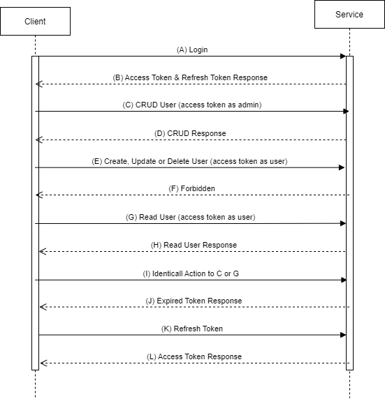

## Flow Diagram

### Explanation

    A. The client sends a Login Request to the service.
    B. The service validates the credentials, if valid then issues an access token and a refresh token.
    C. The client makes CRUD request to the service by presenting the access token with **admin** role.
    D. The service validates the access token, if valid then serves the request.
    E. The client makes Create, Update or Delete request to the service by presenting the access token with **user** role.
    F. The service doesn't allow the access
    G. The client makes Read request to the service by presenting the access token with **user** role.
    H. The service grant the access and serve the request.
    I. Repeat step C or G until the access token expires.
    J. Since the access token is expired, the service returns an expired token response.
    K. The client requests a new access token by presenting the refresh token.
    L. The service validates the refresh token, if valid then issues a new access token.
